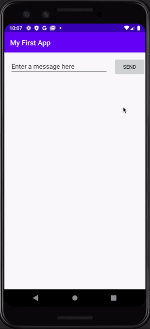

# My First Android App
My first Android app that simply passes string from one view to the next

### Features 
* Home Screen - a string is passed to the next screen when send button is tapped

### App Walk-through

### Run Locally

Project code can be viewed locally and run in Android Studio simulator by cloning/downloading or forking this repo.

## Built With
* [Android Studio - 3.6.1](https://developer.android.com/studio) - The IDE used
* [Kotlin - 1.3.71](https://kotlinlang.org/) - Programming Language

## Author
* Cao Mai - portfolio can be found at:
https://www.makeschool.com/portfolio/Cao-Mai

## License

This project is licensed under the MIT License - see the [LICENSE.md](LICENSE.md) file for details
